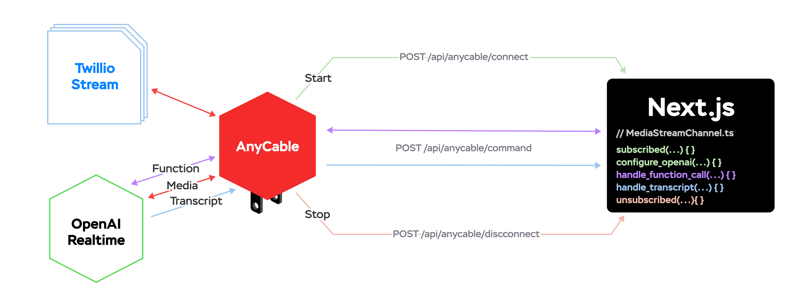

# AnyCable x Twilio Media Streams x OpenAI Realtime (Next.js edition)

This application demonstrates how to use [AnyCable](https://anycable.io) to interact with voice calls via Twilio Streams
and OpenAI Realtime API using Next.js as a server(less)-side and client-side framework.

> [!TIP]
> Read the blog post to learn more about how AnyCable helps to bring phone calls and AI together: [Hey, AnyCable speaking! Needing help with a Twilio-OpenAI connection?](https://evilmartians.com/chronicles/anycable-speaking-needing-help-with-a-twilio-openai-connection).

The app consists of two parts:

- A Next.js application that provides a web UI for managing ToDo items.
- A Go application built with AnyCable that handles Twilio Streams and OpenAI interactions in a logic-agnostic way.



> [!IMPORTANT]
> The Go application lives in the original Rails demo repository: [anycable/twilio-ai-demo](https://github.com/anycable/twilio-ai-demo).

## Requirements

- Node.js 23.0 or higher.
- Twilio and OpenAI accounts (see below).

## Configuration

### Database

This application uses PostgreSQL as a database. You must configure a `DATABASE_URL` env var and run the migrations:

```sh
npm run migrate
```

### Twilio / OpenAI setup

You must obtain a phone number from Twilio and configure it to send status updates to your application (see below).
Similarly, generate an API key for OpenAI.

Then, you can store them in the local configuration as follows:

```txt
# .env
OPENAI_API_KEY=<your key>
```

The application also works in **DTMF mode** (i.e., you can interact with the app using the phone keypad) when OpenAI Realtime is not available.
You can explicitly turn Realtime off by setting the `DISABLE_OPENAI_REALTIME=true`.

## Running the app

You can start the Next.js application by running the following commands:

```sh
# first, install dependencies
npm i

# then, start the app
npm run dev
```

You must also start the AnyCable server. For that, download the binary from the [releases page]() of the original project mathching your platform
and run it:

```sh
# download the binary
curl -L https://github.com/anycable/twilio-ai-demo/releases/latest/download/twilio-ai-cable-`uname -s`-`uname -m` > bin/cable
chmod +x bin/cable

# run it
bin/cable
```

Then, you can visit the app at [localhost:3000](http://localhost:3000). You can manage ToDo items there.

To interact with the app using a phone, you must make both the realtime server (running on the `:8080` by default) and the Next.js
applicaation to be accessible from the Internet. You can use [ngrok](https://ngrok.com) for that:

```sh
# for AnyCable server
ngrok http 8080

# for Next.js app
ngrok http 3000
```

Use the obtained tunnel hostname for AnyCable as follows:

```sh
# .env
TWILIO_STREAM_CALLBACK=https://<your-ngrok-id>.ngrok.io
```

Don't forget to configure your Twilio phone number to use `https://<your-nextjs-ngrok-id>.ngrok.io` as a webhook for status updates.

Now you can make a phone call to your Twilio number and interact with the app using voice commands.

## Calls monitoring

Click on the "Call Logs" button to see call logs in real time.
